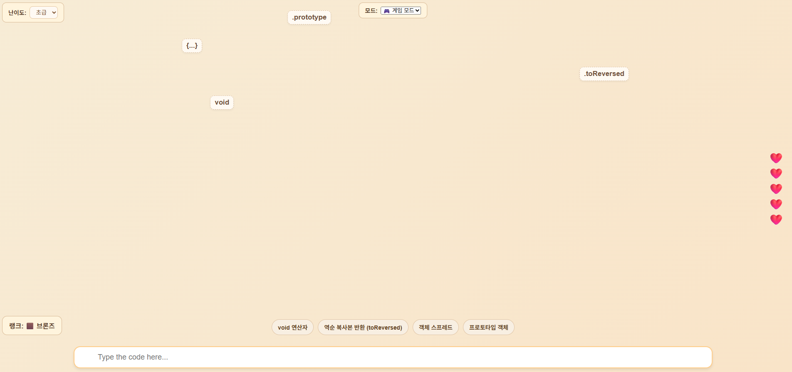
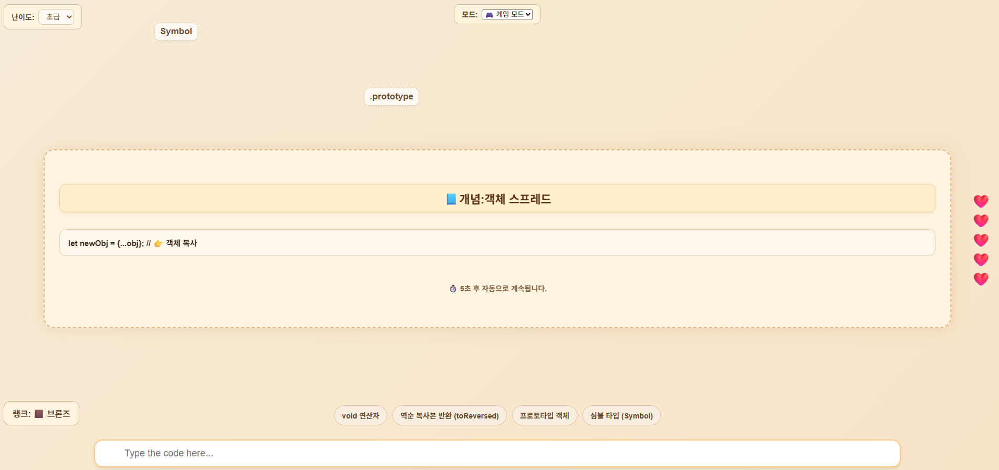

# 🎮 JavaScript 타자 연습 게임 (Code Typer King)

> **"코드 개념을 눈으로 보고, 손으로 치면서 익힌다!"**  
JavaScript 문법을 반복 학습할 수 있는 몰입형 타자 연습 게임입니다.

🔗 **[👉 블로그 바로가기](https://devchannyp-github-io.pages.dev/project/personal/CHAP-01-personal/)**

---

---

## 💡 1단계: 프로젝트 개요

| 항목 | 내용 |
|------|------|
| 🎯 프로젝트명 | JavaScript 개념 타자 게임 (Typing Game for JS Concept) |
| 🧭 목표 | 핵심 개념을 타자 입력 + 시각 피드백으로 반복 학습하는 실습형 웹앱 |
| 🧩 개발 배경 | 타자 입력 → 정답 피드백 → 개념 설명의 루프가 암기보다 효과적이라는 판단에 기반 |

> “이 프로젝트는 JavaScript 핵심 개념을 **눈으로 보고, 손으로 입력하며 기억**할 수 있게 만든 학습 게임입니다.”

---

## 💡 2단계: 주요 기능 및 사용 기술

### 🔧 주요 기능 요약

| 기능 | 설명 |
|------|------|
| ✅ 개념 타이핑 게임 | JS 코드 낙하 → 정답 입력 시 처리 |
| ✅ 개념 버블 표시 | 각 코드의 개념을 풍선 태그로 시각화 |
| ✅ 모드 분기 | 공부 모드: 개념 팝업 표시 / 게임 모드: 점수+랭크 시스템 |
| ✅ 효과음 시스템 | 정답/오답 효과음 + 배경음 재생 |
| ✅ 난이도/속도 조절 | 총 3단계 난이도, 7단계 낙하 속도 |
| ✅ 자동 일시정지 | 탭 이탈 시 애니메이션 자동 멈춤, 복귀 시 재개 |

### 🛠️ 사용 기술 스택

- **HTML/CSS**: 전체 UI/UX 설계 (베이지톤 테마, 반응형 포함)
- **JavaScript (Vanilla)**: 게임 로직, 타자 이벤트, DOM 제어
- **Web Audio API**: 효과음/배경음 제어
- **CSS Animation**: 낙하 효과, 정답 이펙트, 개념 강조 처리

---

## 💡 3단계: 문제 해결 과정

| 문제 | 해결 방법 |
|------|-----------|
| 🔇 브라우저 오디오 자동 차단 | 사용자 상호작용 이후 `audio.play()` 실행 |
| ⏸️ 탭 이동 시 코드 낙하 지속 | `window.blur` / `focus` 이벤트로 자동 정지/재개 |
| 🎯 타이밍 미스 오답 판정 | `getBoundingClientRect()`로 낙하 위치 정밀 판단 |
| 🧠 팝업 중 코드 낙하 유지 | `.paused` 처리 후 `startDropping()`으로 재개 |
| 🎮 게임 모드 점수 반영 누락 | 정답 입력 시 `score++`, `updateRankByScore()` 호출 |

---

## 💡 4단계: 구조별 코드 핵심

| 구성 요소 | 요약 설명 |
|-----------|------------|
| ❤️ 생명 시스템 | `updateLivesDisplay()` → 하트 UI 렌더링 |
| 🏆 랭크 시스템 | `rankLevels`, `updateRankByScore()` → 점수별 티어/속도 반영 |
| ⌨️ 입력 처리 | `keydown + Enter` → 정답 판별 및 개념 강조 |
| 🎈 개념 강조 | `highlightConcept()` → 정답 시 시각 강조 |
| 📘 개념 설명 | `pauseGameForExam()` → 공부 모드일 때 설명 팝업 출력 |
| 🎵 효과음 | `playHitSound()`, `playMissSound()` → 오디오 재생 안전 처리 |
| 🎮 게임 흐름 | `startDropping()`, `dropCode()` → 애니메이션 루프 구성 |

---

## 📊 5단계: 결과 및 성과

✅ **구현 완료 목록**

- 모드 완전 분리: 공부 vs 게임
- 난이도 3단계 + 속도 7단계 조정
- 7단계 랭크 시스템: 브론즈 → 챌린저
- 정답 이펙트, 개념 강조 애니메이션
- 정답/오답/배경음 오디오 UX 완비

📈 **성과 요약 문장**

> “타자 반응성, 시각 몰입감, 개념 학습 피드백을 모두 고려한 실용적 학습 도구를 직접 설계하고 구현했습니다.”

---

## 🔮 6단계: 확장 가능성

| 항목 | 설명 |
|------|------|
| 📦 문제 데이터 외부화 | JSON/Firebase 연동으로 확장 가능 |
| 🧠 개념 다각화 | JS 외에 HTML/CSS/Python 등으로 확장 가능 |
| 🧑‍🎓 리더보드 | 점수 기반 랭킹 시스템 도입 가능 |
| 📱 모바일 최적화 | 세로 레이아웃 + 키보드 대응 개선 |
| 💡 코드 하이라이팅 | `highlight.js` 등 적용 가능성 존재 |

---

## 📂 폴더 구조
📦 javascript-typing-master
┣ 📄 index.html # 메인 게임 HTML
┣ 📁 images/ # 스크린샷, 이미지
┃ ┣ 자바스크1.png
┃ ┗ 자바스크2.png
┣ 📁 assets/ # 효과음, 배경음 등
┗ 📄 README.md # 설명 문서 (이 파일)

---

## 🚀 실행 방법

1. 저장소 클론
git clone https://github.com/DevchannyP/javascript-typing-master.git

2. 브라우저로 index.html 열기

또는 Live Server 확장으로 실행

🔗 배포 링크
👉 https://devchannyp-github-io.pages.dev/project/personal/CHAP-01-personal/

📜 라이선스
이 프로젝트는 MIT License를 따릅니다.
자유롭게 수정, 배포, 상업적 활용이 가능하나 저작자 표시가 필요합니다.

🙋 만든 사람
박찬희 (Chanhee Park)
프론트엔드 & 백엔드 풀스택 개발자

GitHub: DevchannyP

"타자 속도보다 정확성이 중요하다는 철학으로 직접 만든 학습 도구입니다."

